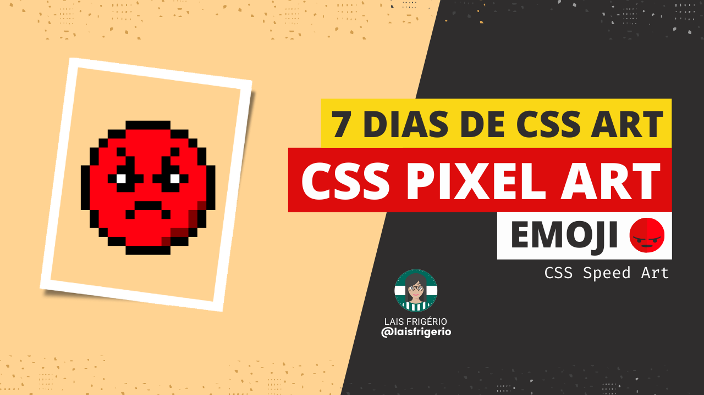
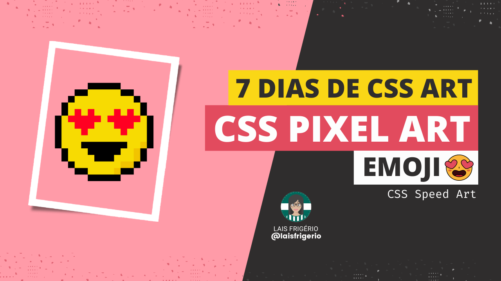
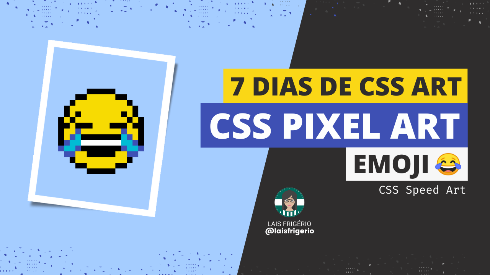
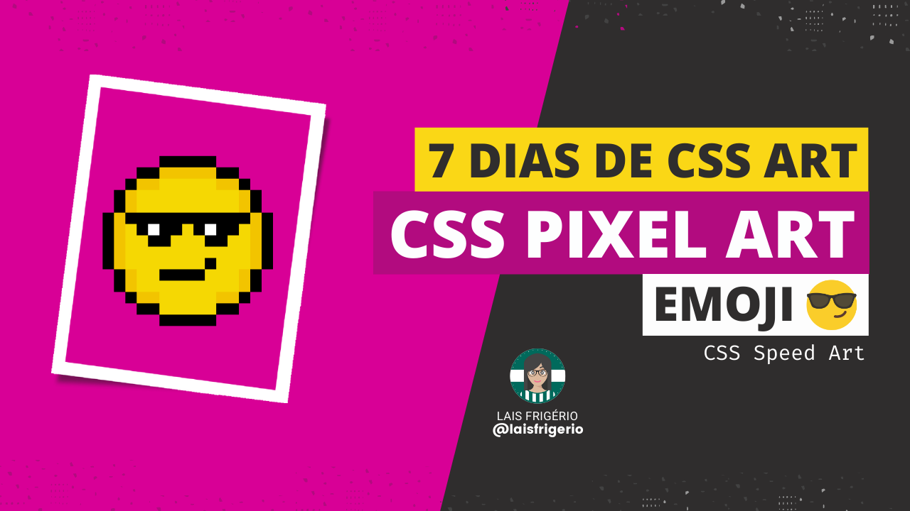

# 7 Days Of CSS Challenge

- [x] Dia 01 - Emoji Face with Medical Mask | [Youtube vídeo](https://youtu.be/RFn5CJKgdVU)

  

- [x] Dia 02 - Emoji crying | [Youtube vídeo](https://youtu.be/dzsLeQnbCTo)

  

- [x] Dia 03 - Emoji surprised | [Youtube vídeo](https://youtu.be/6Ts16VFr-04)

  

- [x] Dia 04 - Emoji angry | [Youtube vídeo](https://youtu.be/jBm73la_4hs)

  

- [x] Dia 05 - Emoji smiling face with heart-eyes | [Youtube vídeo](https://youtu.be/n7fdaaGV3w4)

  

- [x] Dia 06 - Emoji Face with Tears of Joy | [Youtube vídeo](https://youtu.be/89HfhuvO4Mg)

  

- [x] Dia 07 - Emoji Face with Sunglasses | [Youtube vídeo](https://youtu.be/nZCNpuuwsKk)

  

## 👩 Author

| [ <b>@laisfrigerio</b>](https://github.com/laisfrigerio)  |
| :---: |

## 📄 License

This project is licensed under the MIT License - see the LICENSE.md file for details